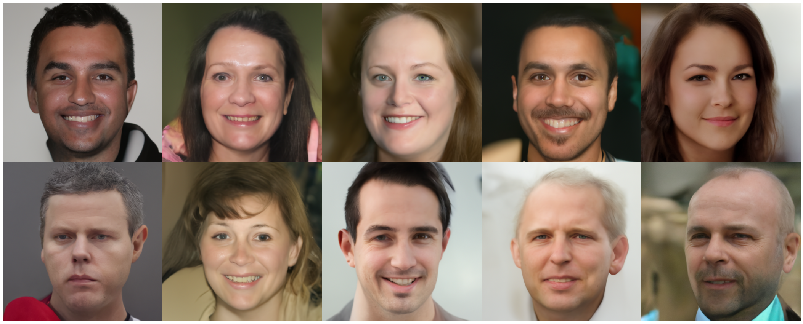
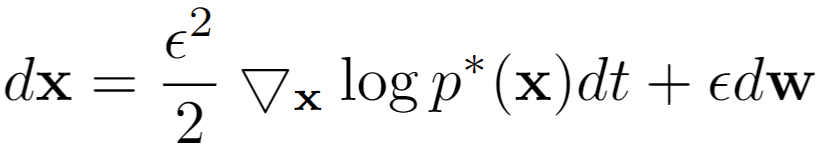
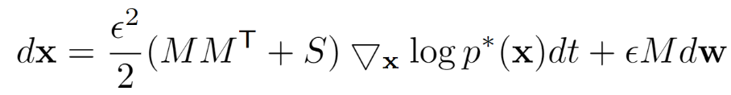

# Accelerating Score-based Generative Models with Preconditioned Diffusion Sampling
###  [Paper](https://arxiv.org/abs/)
> [**Accelerating Score-based Generative Models with Preconditioned Diffusion Sampling**](https://arxiv.org/abs/),            
> Hengyuan Ma, Li Zhang, Xiatian Zhu, and Jianfeng Feng   
> **ECCV 2022**

## News
- [2022/07/04]: PDS is accepted by **ECCV 2022**!

## Abstract
Score-based generative models (SGMs) have recently emerged as a promising class of generative models. However, a fundamental limitation is that their inference is very slow due to a need for many (e.g., 2000) iterations of sequential computations. An intuitive acceleration method is to reduce the sampling iterations which however causes severe performance degradation. We investigate this problem by viewing the diffusion sampling process as a Metropolis adjusted Langevin algorithm, which helps reveal the underlying cause to be ill-conditioned curvature. Under this insight, we propose a model-agnostic preconditioned diffusion sampling (PDS) method that leverages matrix preconditioning to alleviate the aforementioned problem. Crucially, PDS is proven theoretically to converge to the original target distribution of a SGM, no need for retraining. Extensive experiments on three image datasets with a variety of resolutions and diversity validate that PDS consistently accelerates off-the-shelf SGMs whilst maintaining the synthesis quality. In particular, PDS can accelerate by up to 29x on more challenging high resolution (1024x1024) image generation.

## Demo

FFHQ facial images (1024x1024) generated by vanilla NCSN++ using 2000,  200, 133, 100 and 66 sampling iterations (from left to right).


FFHQ facial images (1024x1024) generated by PDS + NCSN++ using 2000,  200, 133, 100 and 66 sampling iterations (from left to right).

## Preconditioned diffusion sampling

The Langevin dynamics applied by vanilla SGMs for generating samples is



To accelerate the convergence while keeping the steady state distribution, our PDS use the following preconditioned Langevin dynamics


where the preconditioning matrix M can be constructed by priori knowledge from the target dataset in frequency domain or space (pixel) domain, S can be any skew-
symmetric matrix.

## License

[MIT](LICENSE)
## Reference

```bibtex
@inproceedings{ma2022pds,
  title={Accelerating Score-based Generative Models with Preconditioned Diffusion Sampling},
  author={Hengyuan Ma, Li Zhang, Xiatian Zhu, and Jianfeng Feng},
  booktitle={European Conference on Computer Vision},
  year={2022}
}
```
