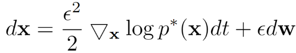

# Accelerating Score-based Generative Models with Preconditioned Diffusion Sampling
###  [Paper](http://arxiv.org/abs/2207.02196)
> [**Accelerating Score-based Generative Models with Preconditioned Diffusion Sampling**](http://arxiv.org/abs/2207.02196),            
> Hengyuan Ma, Li Zhang, Xiatian Zhu, and Jianfeng Feng   
> **ECCV 2022**

## News
- [2022/07/04]: PDS is accepted by **ECCV 2022**!

## Abstract
Score-based generative models (SGMs) have recently emerged as a promising class of generative models. However, a fundamental limitation is that their inference is very slow due to a need for many (e.g., 2000) iterations of sequential computations. An intuitive acceleration method is to reduce the sampling iterations which however causes severe performance degradation. We investigate this problem by viewing the diffusion sampling process as a Metropolis adjusted Langevin algorithm, which helps reveal the underlying cause to be ill-conditioned curvature. Under this insight, we propose a model-agnostic **preconditioned diffusion sampling (PDS)** method that leverages matrix preconditioning to alleviate the aforementioned problem. Crucially, PDS is proven theoretically to converge to the original target distribution of a SGM, no need for retraining. Extensive experiments on three image datasets with a variety of resolutions and diversity validate that PDS consistently accelerates off-the-shelf SGMs whilst maintaining the synthesis quality. In particular, PDS can accelerate by up to 29x on more challenging high resolution (1024x1024) image generation.

## Demo

[FFHQ](https://github.com/NVlabs/ffhq-dataset) facial images (1024x1024) generated by vanilla [NCSN++](https://github.com/yang-song/score_sde) using 2000,  200, 133, 100 and 66 sampling iterations (from left to right).


FFHQ facial images (1024x1024) generated by [NCSN++](https://github.com/yang-song/score_sde) **w/ PDS** using 2000,  200, 133, 100 and 66 sampling iterations (from left to right).

## Preconditioned diffusion sampling

The Langevin dynamics applied by vanilla SGMs for generating samples is



To accelerate the convergence while keeping the steady state distribution, our PDS use the following preconditioned Langevin dynamics


where the preconditioning matrix M can be constructed by priori knowledge from the target dataset in frequency domain or space (pixel) domain, S can be any skew-symmetric matrix.


## Running the Experiments

Sampling using PDS through `main.py`.
```
$ python main.py --config: Model configuration. (default: 'None')
                 --workdir: Working directory. (default: 'None')
                 --eval_folder: Output directory. (default: 'eval')
                 --speed_up: Speedup ratio. 
                 --freq_mask_path: Path to the frequency filter. (default: 'None')
                 --space_mask_path: Path to the space filter. (default: 'None') 
                 --alpha: The setting of the parameter alpha. (default: 5)
```
* `config` is the path to the config file provided in `configs/`. 
* `workdir` is the path that stores checkpoints and samples. Pretrained checkpoints should be stored in `workdir/checkpoints/` before sampling. Please download the checkpoints [here](https://github.com/yang-song/score_sde_pytorch).
* `eval_folder` is the name of a subfolder in `workdir` for storing samples.
* `speed_up` is the ratio (float) that the sampling process is accelerated, compared to the original one. If it is set to 20, the sampling iterations will shrink 20 times, and every step size will increase up to 20 times. The settings of sampling iterations and step size can be found in config files.
* `freq_mask_path` and `space_mask_path` are the paths to the calculated frequency and space filters. We provide precalculated filters [here](https://drive.google.com/drive/folders/1HpDVij2jXRGo4Pi5M1BQbGjNquiZ0vgr?usp=sharing). 
* `alpha` is the setting of the parameter that normalize the frequency filter.


Example: sampling FFHQ (1024x1024) dataset with both frequency and space filter, under 30 times acceleration.
```
$ python main.py --config ./configs/ve/ffhq_ncsnpp_continuous.py --workdir  yourworkdir --speed_up 30 --freq_mask_path ./ffhq_freq.npy --space_mask_path ./ffhq_space.npy
```
Example: sampling LSUN bedroom (256x256) dataset with only frequency filter, under 12 times acceleration.
```
$ python main.py --config ./configs/ve/bedroom_ncsnpp_continuous.py --workdir  yourworkdir --speed_up 12 --freq_mask_path ./bedroom_freq.npy
```

## License

[MIT](LICENSE)
## Reference

```bibtex
@inproceedings{ma2022pds,
  title={Accelerating Score-based Generative Models with Preconditioned Diffusion Sampling},
  author={Ma, Hengyuan and Zhang, Li and Zhu, Xiatian and Feng, Jianfeng},
  booktitle={European Conference on Computer Vision},
  year={2022}
}
```

## Acknowledgement
Thanks to previous open-sourced repo:
[NCSN++](https://github.com/yang-song/score_sde_pytorch)